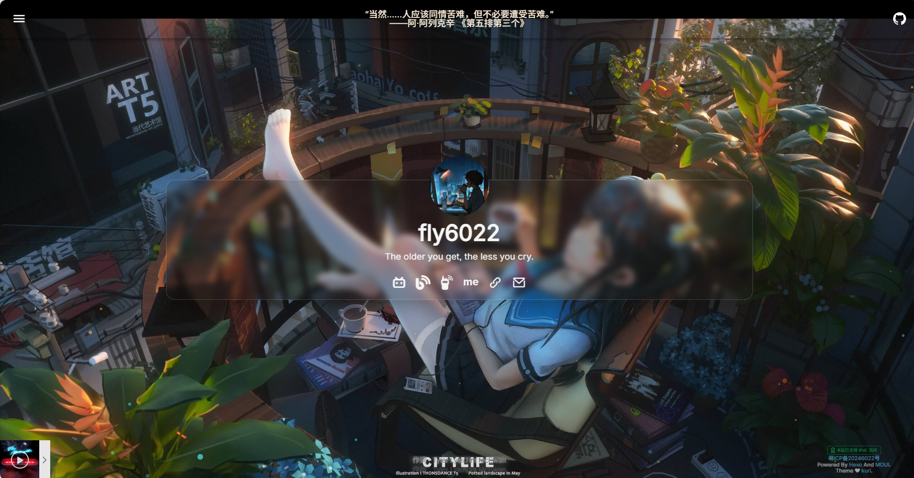

# hexo-theme-kuri


🤗 基于 Hexo & MDUI 的轻量级个人主页。

## 💻 预览



- [KuriCL](https://kuri.ink/)

## ⭐ 特点

- 单页面个人主页
- Material Design设计语言
- 毛玻璃效果
- 自适应夜晚模式
- Bing 每日图片
- APlayer 音乐播放器
- 摛藻 书摘
- 自定义侧边栏及社交按钮

## 🚀 使用

### 安装 Kuri

在安装之前，请参照 [Hexo](https://hexo.io/) 文档，完成初始化。

```bash
cd {hexo目录}/themes
git clone git@github.com:fly6022/hexo-theme-kuri.git
hexo config theme hexo-theme-kuri
```

### 配置 Kuri

1. 在 **Hexo 目录**下的`source`文件夹中创建一个`index.md`空文件。
2. 编辑**主题目录**下的`.config.yml`文件。

### 运行 Kuri

```bash
hexo server --debug
```

当命令行输出以下内容时，表示 Hexo 正在本地机器上的端口 4000 上侦听。使用浏览器访问 http://localhost:4000/ 检查网站是否正常运行。

```bash
INFO  Hexo is running at http://localhost:4000/. Press Ctrl+C to stop.
```

## 😎 贡献

Fork 本项目，并发起 Pull Request。

### Pull request title

```yml
 - feat: A new feature
 - fix: A bug fix
 - docs: Documentation only changes
 - style: Changes that do not affect the meaning of the code (white-space, formatting, missing semi-colons, etc)
 - refactor: A code change that neither fixes a bug nor adds a feature
 - perf: A code change that improves performance
 - test: Adding missing tests or correcting existing tests
 - build: Changes that affect the build system or external dependencies (example scopes: gulp, broccoli, npm)
 - ci: Changes to our CI configuration files and scripts (example scopes: Travis, Circle, BrowserStack, SauceLabs)
 - chore: Other changes that don't modify src or test files
 - revert: Reverts a previous commit
```

## 📃 许可证

GPL v3.

## 🤝 致谢

1. 感谢 @bolangLEE12138 反馈的问题，现已改正。`version 1.1.2`